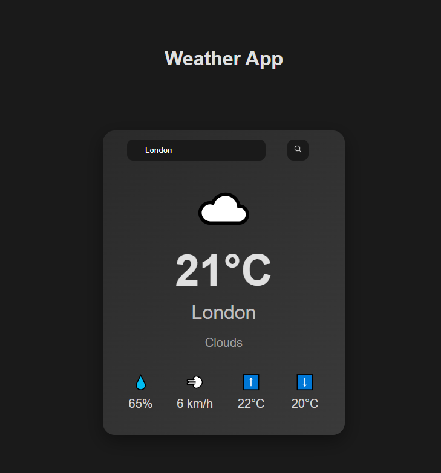

# Vite Weather App



A modern, fast weather application built with Vite that provides current weather information for any city worldwide with a beautiful card-based UI.

## Features

- **City Search**: Enter any city name to get current weather data
- **Current Temperature**: Displays temperature in Celsius
- **Weather Conditions**: Shows weather status with appropriate emoji icons (sunny ☀️, cloudy ☁️, rainy 🌧️, snowy ❄️, thunderstorm ⚡)
- **Detailed Statistics**:
  - 💧 Humidity percentage
  - 💨 Wind speed
  - ⬆️ Maximum temperature
  - ⬇️ Minimum temperature
- **Persistent Storage**: Remembers your last searched city using localStorage
- **Keyboard Support**: Press Enter to search for weather
- **Component-Based Architecture**: Modular structure with reusable components

## Technologies Used

- **Vite** - Next generation frontend tooling
- **JavaScript (ES6+)** - Application logic and API integration
- **CSS Modules** - Scoped styling for components
- **OpenWeatherMap API** - Weather data provider

## Getting Started

### Prerequisites

- Node.js (version 14 or higher)
- npm or yarn
- An API key from [OpenWeatherMap](https://openweathermap.org/api)

### Installation

1. Clone the repository:
   ```bash
   git clone https://github.com/antonmakarovv/Vite-Weather-Cards.git
   ```

2. Navigate to the project directory:
   ```bash
   cd Vite-Weather-Cards
   ```

3. Install dependencies:
   ```bash
   npm install
   ```

4. Add your OpenWeatherMap API key in `src/main.js`:
   ```javascript
   const apiKey = 'your-api-key-here';
   ```

5. Start the development server:
   ```bash
   npm run dev
   ```

6. Open your browser and navigate to `http://localhost:5173`

## Available Scripts

- `npm run dev` - Start development server
- `npm run build` - Build for production
- `npm run preview` - Preview production build locally

## Usage

1. Enter a city name in the input field
2. Click the search button (magnifier icon) or press Enter
3. View the current weather information displayed in elegant cards

## Project Structure

```
Vite-Weather-Cards/
├── public/
│   ├── magnifier.png          # Search icon
│   └── screenshot.png         # Application screenshot
├── src/
│   ├── components/
│   │   ├── CityName/          # City name display component
│   │   ├── Description/       # Weather description component
│   │   ├── GetWeatherBtn/     # Search button component
│   │   ├── InputCityName/     # City input component
│   │   ├── ShowStatPage/      # Statistics display component
│   │   ├── ShowWeatherPage/   # Main weather display component
│   │   ├── TemperatureStat/   # Temperature display component
│   │   ├── WeatherCard/       # Main card container component
│   │   └── WeatherIcon/       # Weather icon component
│   ├── main.js                # Application entry point
│   └── style.css              # Global styles
├── index.html                 # HTML template
└── package.json               # Project configuration
```

## API Reference

This app uses the [OpenWeatherMap API](https://openweathermap.org/current) to fetch weather data.

**Endpoint**: `https://api.openweathermap.org/data/2.5/weather`

**Parameters**:
- `q`: City name
- `units`: Measurement units (metric for Celsius)
- `appid`: Your API key

## Contributing

Feel free to submit issues and enhancement requests!

## License

This project is open source and available under the [MIT License](LICENSE).

## Author

Anton Makarov
